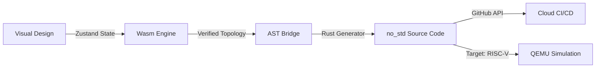

# 🛰️ Morphism.io IDE

> **Mathematical Topology & Bare-metal Infrastructure as Design.**


Morphism.io is a high-performance mathematical IDE designed for engineers who bridge the gap between abstract topology and bare-metal reality. From Entropy-driven source coding to Cryptographic Group theory, Morphism provides a visual-native environment to design, verify, and compile mission-critical algorithms.

---

## 🌌 The Morphism Philosophy

In high-reliability engineering (Space, Crypto, Kernels), **code is just a shadow of mathematics.** Conventional IDEs treat math as a library import; Morphism treats math as the **Source of Truth**.

1.  **Topology First**: Design complex DAGs or Cayley Graphs with real-time physics.
2.  **Wasm-Accelerated Logic**: High-density math is offloaded to a Rust/WebAssembly core.
3.  **Zero-Cost Abstractions**: Generate `no_std` Rust code optimized for microkernels and embedded silicon.
4.  **Hardware-in-the-Loop**: Verify generated logic on simulated RISC-V hardware via integrated QEMU pipelines.

---

## 🛠️ Architecture Overview

The system operates as a unified pipeline from design to deployment:



### Key Components
- **`morphism-io-ide`**: The frontend cockpit built with React, Tailwind CSS, and Monaco Editor.
- **`morphism-core`**: The Rust-based Wasm engine for real-time topological solver.
- **`morphism-qemu-sim`**: A pure bare-metal RISC-V 32-bit runtime for hardware validation.

---

## 🚀 Quick Start

### Frontend (IDE)
```bash
npx npm install
npm run dev
```

### Bare-Metal Simulation (RISC-V)
Requires [QEMU](https://www.qemu.org/) installed.
```bash
cd morphism-qemu-sim
# Temporary fix for path if needed: $env:Path += ";$env:USERPROFILE\.cargo\bin"
cargo run
```

---

## 🪐 Feature Spotlight: Deep Space Telemetry Rescue

Morphism.io was used to rescue the communication link of **Explorer IV** near Europa. By re-calculating the Huffman topology based on 80/10/10 sensor probabilities, we compressed telemetry from 32-bits down to a 9-bit variable-length stream, saving vital bandwidth for orbital imagery.

---

## 🛠️ Tech Stack
- **Frontend**: React 18, Zustand, D3-Force, Monaco Editor.
- **Math Engine**: Rust, Wasm-bindgen, wasm-pack.
- **Simulation**: RISC-V 32-bit (imac variant), QEMU Virt, Serial/UART Driver.
- **Integration**: GitHub REST API (Git Data).

---

## 🛡️ License
Engineering-grade open source under the MIT License.

---
*Built with intensity for the next generation of hardware-first math.*
